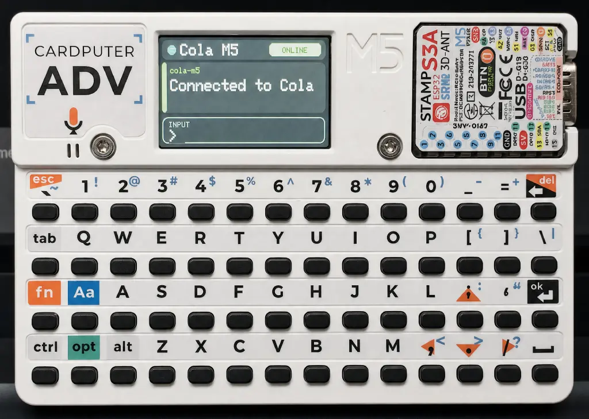

# cola-m5

Connect M5Stack devices to [Cola](https://colaos.ai).

<p align="center"></p>

> [!NOTE]\
> This project is still in early development and may have limited functionality or stability.
> All features and configuration options are subject to change.

This repository has two parts:

- `plugin/`: the Cola plugin that runs on the computer with Cola.
- `firmware/`: M5Stack firmware targets and shared firmware code.

The current transport is local Wi-Fi with WebSocket:

```text
M5Stack device <-> cola-m5 plugin <-> Cola
```

The protocol is intentionally model-agnostic so more M5Stack devices can be added later.

## Supported devices

- [M5Stack Cardputer](https://shop.m5stack.com/products/m5stack-cardputer-adv-version-esp32-s3) - keyboard text input with replies on the built-in screen.
- [M5Stack StickS3](https://shop.m5stack.com/products/m5sticks3-esp32s3-mini-iot-dev-kit) - setup portal plus two-button shortcut input with replies on the built-in screen.

## Layout

```text
cola-m5/
  plugin/
    src/index.ts
  firmware/
    common/
      include/cola_m5/
      src/
    cardputer/
      platformio.ini
      src/main.cpp
      include/config.h
    stick-s3/
      platformio.ini
      src/main.cpp
      include/config.h
  docs/
    protocol.md
```

## Install the Cola plugin

Build the plugin:

```bash
npm install
npm run build
```

Then install the local `plugin/` directory in Cola's plugin settings.

The plugin exposes a channel named `M5Stack` and listens on port `8787` by default. If your local network needs a different port, change it in the channel config.

To find the LAN IP for firmware setup, run one of these on the computer running Cola:

```bash
ipconfig getifaddr en0
ipconfig getifaddr en1
```

## Flash the Cardputer firmware

Install PlatformIO first:

```bash
python3 -m pip install platformio
```

The firmware includes a default `config.h` with an empty Cola host. Edit `firmware/cardputer/include/config.h`:

```cpp
#define COLA_HOST "192.168.1.23"
#define COLA_PORT 8787
#define DEVICE_ID "m5-cardputer-01"
```

- `COLA_HOST` should be the LAN IP of the computer running Cola. The computer and Cardputer must be on the same Wi-Fi.
- The Wi-Fi ID and password are entered on the Cardputer during boot and saved on the device.
- `config.h` is committed with safe defaults.

Connect the Cardputer over USB-C. If upload fails, put it into download mode:

1. Set the top power switch to `OFF`.
2. Hold `G0`.
3. Plug in USB-C.
4. Release `G0`.

Upload:

```bash
cd firmware/cardputer
pio run -t upload
```

Open the serial monitor:

```bash
pio device monitor
```

## Flash the StickS3 firmware

The StickS3 target uses a setup portal because the device does not have a keyboard. You can leave `firmware/stick-s3/include/config.h` with safe defaults, or set `COLA_HOST` as a prefilled default for the setup page:

```cpp
#define COLA_HOST "192.168.1.23"
#define COLA_PORT 8787
#define DEVICE_ID "m5-stick-s3-01"
```

Upload:

```bash
cd firmware/stick-s3
pio run -t upload
```

Open the serial monitor:

```bash
pio device monitor
```

## Cardputer usage

After the firmware boots:

1. Confirm the Wi-Fi ID. If a saved ID exists, it is already filled in; press `Enter` to use it or `Del` to clear it.
2. Confirm the Wi-Fi password. If a saved password exists, it is already filled in and shown as `*`; press `Enter` to use it or `Del` to clear it.
3. Wait until the screen shows that Wi-Fi and Cola are connected.
4. Type a message on the Cardputer keyboard.
5. Press `Enter` to send it to Cola.

Cola replies are rendered on the Cardputer screen.

## StickS3 usage

On first boot, or when saved setup is missing, the StickS3 starts a Wi-Fi setup access point:

1. Connect a phone or computer to the AP shown on the StickS3 screen, such as `Cola-StickS3-123ABC`.
2. Open `http://192.168.4.1`.
3. Enter the Wi-Fi ID, Wi-Fi password, Cola host, and Cola port.
4. Save the form and wait for the device to connect.

After setup:

1. Press `A` to cycle the selected shortcut. If a Cola reply has multiple pages, `A` advances the page first.
2. Press `B` to send the selected shortcut to Cola.
3. Hold `A` to go to the previous reply page.
4. Hold `A+B` to reopen setup mode and replace the saved Wi-Fi or Cola host settings.

## Firmware shared code

`firmware/common/` is a local PlatformIO library shared by firmware targets. It owns:

- Wi-Fi and Cola host storage in `Preferences`.
- Wi-Fi connect and reconnect helpers.
- WebSocket connection handling.
- Cola JSON protocol serialization and parsing.
- The StickS3 setup portal.

## Notes

The first version auto-binds device identities in the Cola plugin to keep hardware development fast. Before using this on an untrusted network, add a pairing token or another auth flow.

## License

MIT
