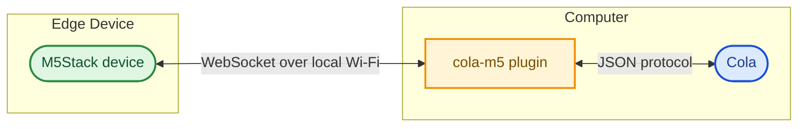

# cola-m5

Connect M5Stack devices to [Cola](https://colaos.ai).

> [!NOTE]\
> This project is still in early development and may have limited functionality or stability.
> All features and configuration options are subject to change.

This repository has two parts:

- `./plugin` - the Cola plugin that runs on the computer with Cola.
- `./firmware` - M5Stack firmware targets and shared firmware code.

The current transport is local Wi-Fi with WebSocket:

The protocol is intentionally model-agnostic so more M5Stack devices can be added later.

## Supported devices

- [M5Stack Cardputer firmware](./firmware/cardputer/README.md) ([device](https://shop.m5stack.com/products/m5stack-cardputer-adv-version-esp32-s3)) - keyboard text input with replies on the built-in screen.
- [M5Stack Xiaozhi Card Kit firmware](./firmware/xiaozhi-card-kit/README.md) ([device](https://docs.m5stack.com/en/guide/realtime/xiaozhi/xiaozhi_card_kit)) - experimental e-paper target with setup portal and simple shortcut input.
- [M5Stack StickS3 firmware](./firmware/stick-s3/README.md) ([device](https://shop.m5stack.com/products/m5sticks3-esp32s3-mini-iot-dev-kit)) - setup portal plus two-button shortcut input with replies on the built-in screen.

Device-specific flash and usage instructions live in each firmware target's README.

Protocol details are documented in [docs/protocol.md](./docs/protocol.md).

Cola plugin setup and settings are documented in [plugin/README.md](./plugin/README.md).

## Firmware shared code

`./firmware/common` is a local PlatformIO library shared by firmware targets. It owns:

- Wi-Fi and Cola host storage in `Preferences`.
- Wi-Fi connect and reconnect helpers.
- WebSocket connection handling.
- Cola JSON protocol serialization and parsing.
- The StickS3 setup portal.

## Notes

The first version auto-binds device identities in the Cola plugin to keep hardware development fast. Before using this on an untrusted network, add a pairing token or another auth flow.

## License

MIT
